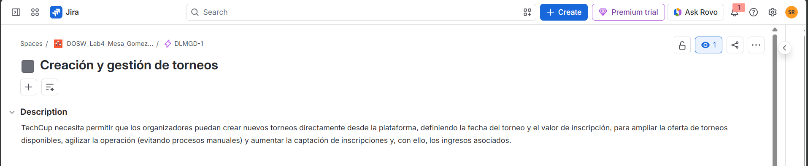
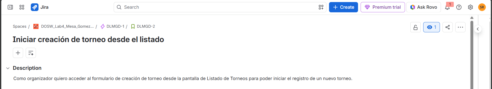
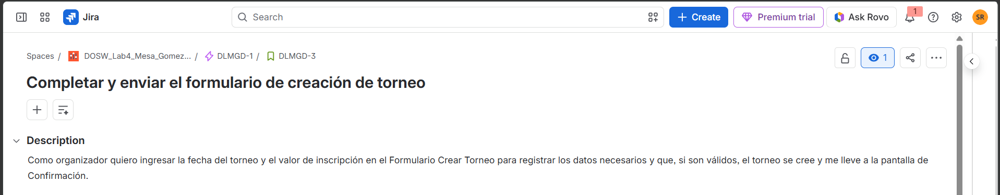
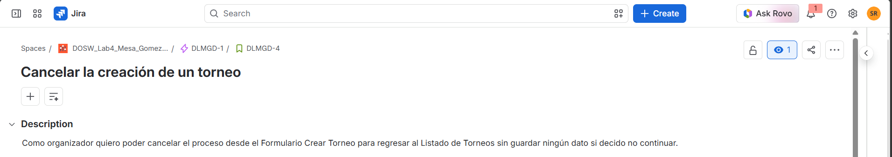
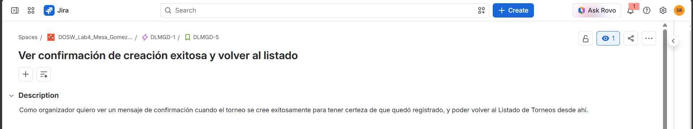

# Planeación del Sistema en Jira

## Desglose de trabajo: Épicas, Historias de Usuario y Tareas

La implementación de los requerimientos identificados de TechCup se documenta en Jira de la siguiente manera:

## 1. Épica

**ID en Jira:** DLMGD-1

## 2. Historias de usuario

### HU-01 – Iniciar creación de torneo desde el listado

**ID en Jira:** DLMGD-2

### HU-02 – Completar y enviar el formulario de creación de torneo

**ID en Jira:** DLMGD-3

### HU-03 – Cancelar la creación de un torneo

**ID en Jira:** DLMGD-4

### HU-04 – Ver confirmación de creación exitosa y volver al listado

**ID en Jira:** DLMGD-5

## 3. Tareas

*(Aquí irán los screenshots de las 12 Tasks)*

## 4. Cronograma

*(Aquí irá el screenshot del Timeline de Jira)*

## 5. Backlog

*(Esta sección se completará en la Parte 5 - Sprint Planning)*