# Planeación del Sistema en Jira

## Desglose de trabajo: Épicas, Historias de Usuario y Tareas

La implementación de los requerimientos identificados de TechCup se documenta en Jira de la siguiente manera:

## 1. Épica

**ID en Jira:** DLMGD-1

## 2. Historias de usuario

### HU-01 – Iniciar creación de torneo desde el listado

**ID en Jira:** DLMGD-2

### HU-02 – Completar y enviar el formulario de creación de torneo

**ID en Jira:** DLMGD-3

### HU-03 – Cancelar la creación de un torneo

**ID en Jira:** DLMGD-4

### HU-04 – Ver confirmación de creación exitosa y volver al listado

**ID en Jira:** DLMGD-5

## 3. Tareas

### TR-01 – Diseñar botón "Crear Torneo" en el Listado de Torneos

**ID en Jira:** DLMGD-6

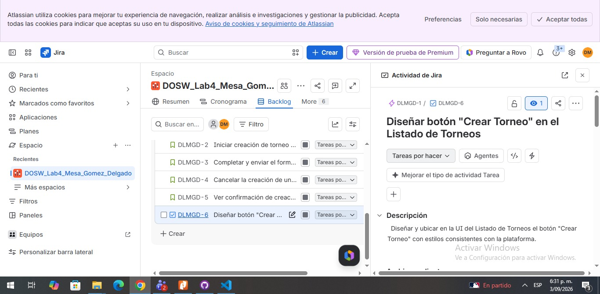

### TR-02 – Implementar navegación hacia el Formulario Crear Torneo

**ID en Jira:** DLMGD-7

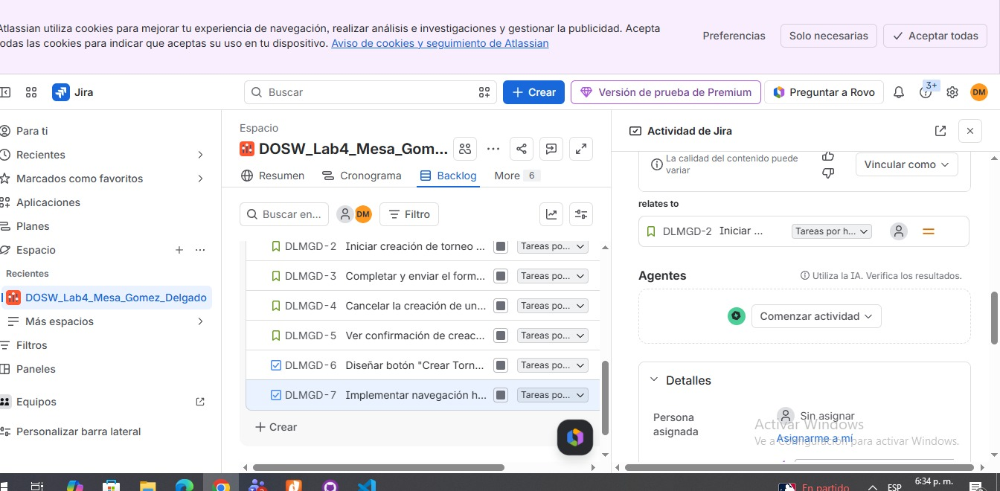

### TR-03 – Probar navegación Listado a Formulario

**ID en Jira:** DLMGD-8

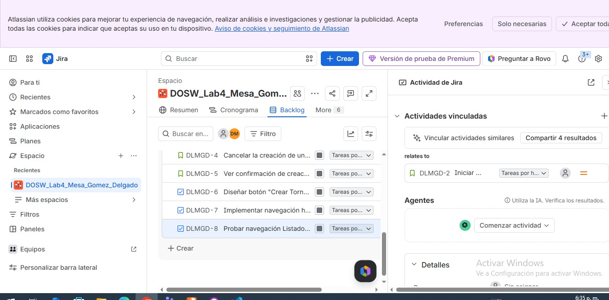

### TR-04 – Diseñar UI del Formulario Crear Torneo

**ID en Jira:** DLMGD-9

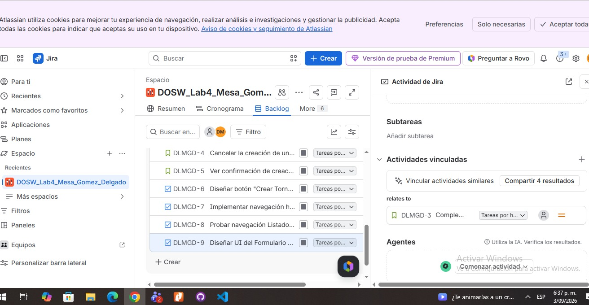

### TR-05 – Implementar validaciones de los campos del formulario

**ID en Jira:** DLMGD-10

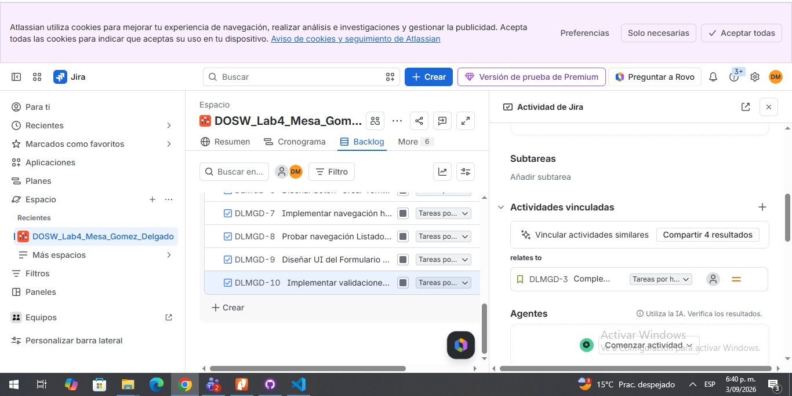

### TR-06 – Implementar envío del formulario y creación del torneo

**ID en Jira:** DLMGD-11

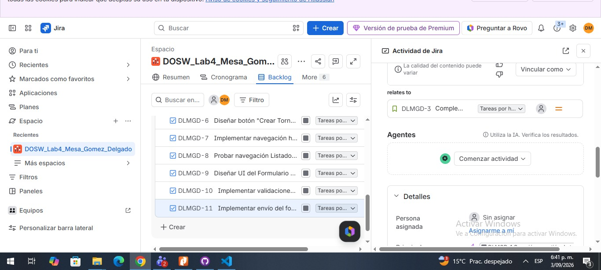

### TR-07 – Agregar botón "Cancelar" en el Formulario Crear Torneo

**ID en Jira:** DLMGD-12

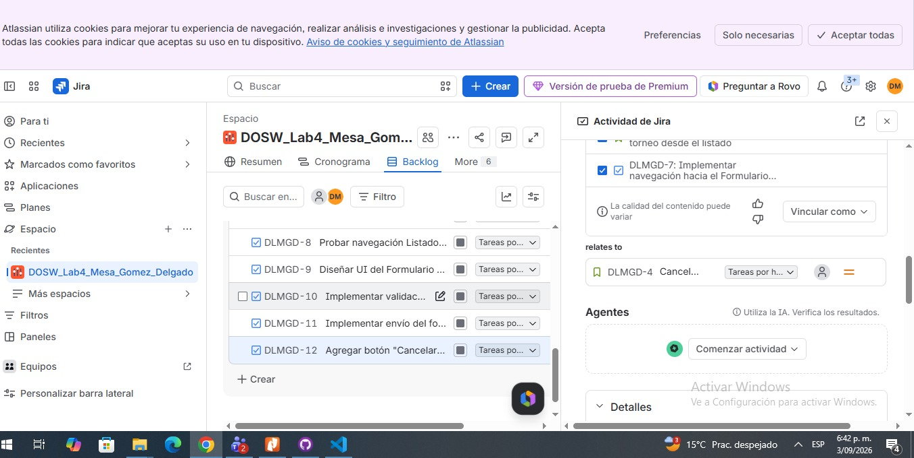

### TR-08 – Implementar navegación de "Cancelar" hacia el Listado

**ID en Jira:** DLMGD-13

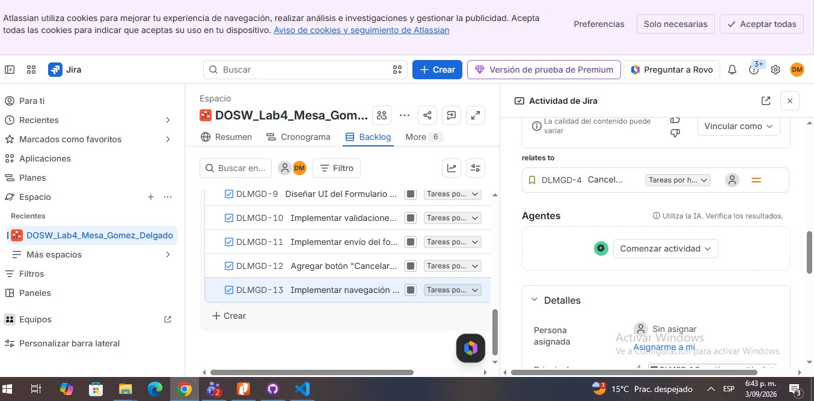

### TR-09 – Probar que "Cancelar" no persiste datos

**ID en Jira:** DLMGD-14

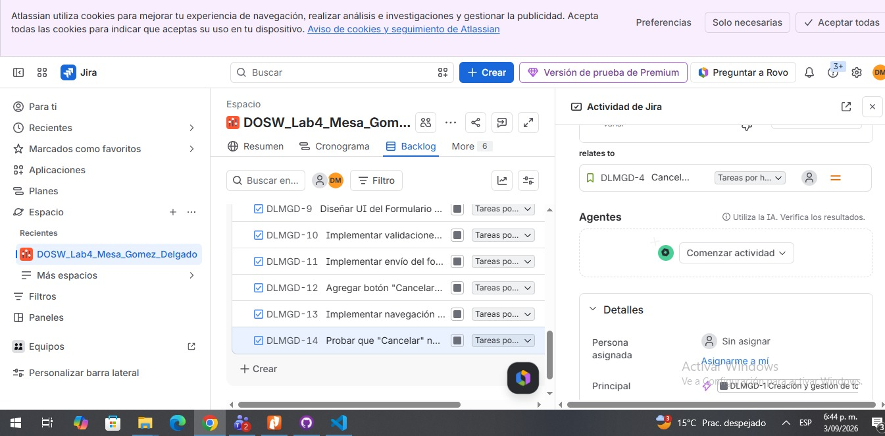

### TR-10 – Diseñar pantalla de Confirmación

**ID en Jira:** DLMGD-15

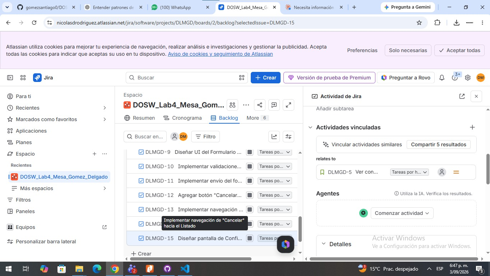

### TR-11 – Implementar navegación Formulario a Confirmación

**ID en Jira:** DLMGD-16

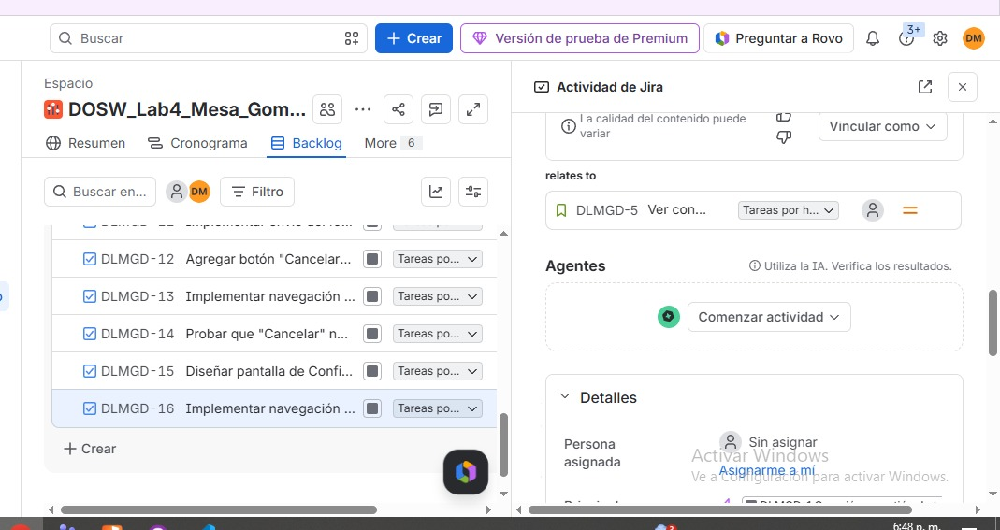

### TR-12 – Implementar botón "Volver" en Confirmación

**ID en Jira:** DLMGD-17

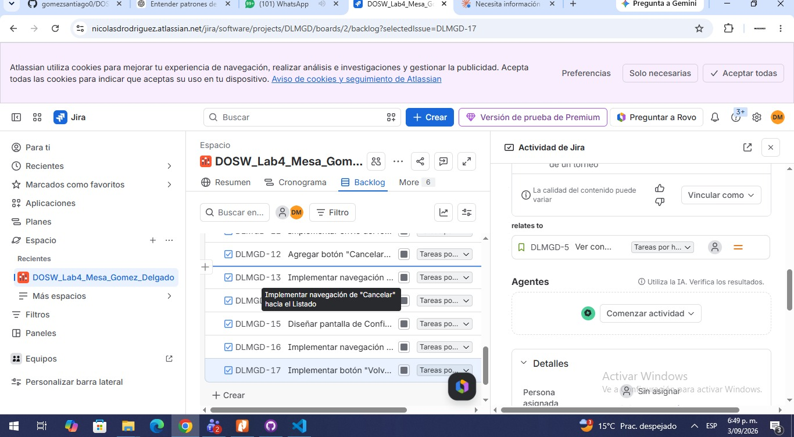

## 4. Cronograma

**Timeline / Roadmap:**

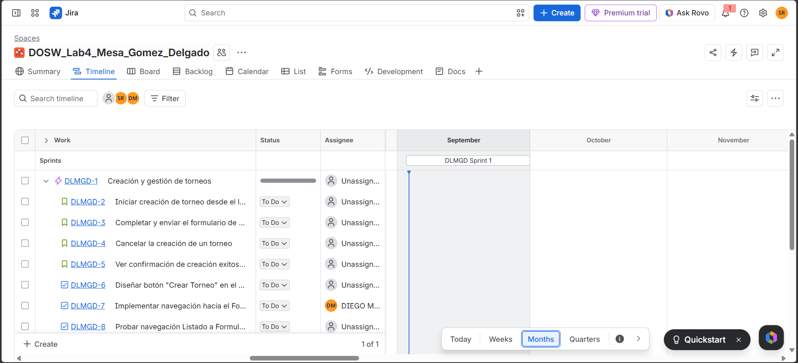

## 5. Backlog

*(Esta sección se completará en la Parte 5 - Sprint Planning)*
