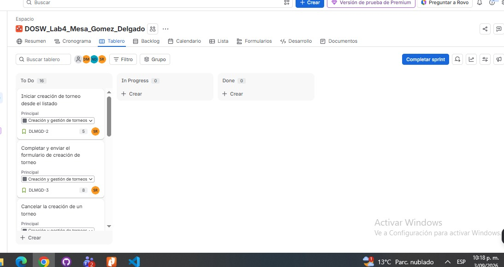
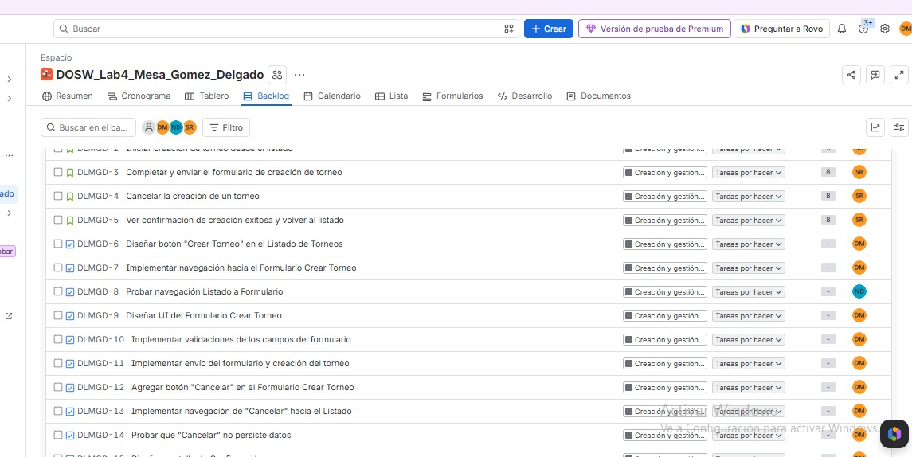

## 5. Backlog

### Sprint Planning

**Sprint:** DLMGD Sprint 1
**Duración:** 3 sep – 30 sep
**Historias incluidas:** HU-01 a HU-04 (DLMGD-2 a DLMGD-5)
**Estimación total:** 29 story points (5 + 8 + 8 + 8)
**Estado:** Sprint iniciado — 16 actividades (4 HU + 12 Tareas)

### Asignaciones del Sprint

| ID | Actividad | Responsable |
|----|-----------|-------------|
| DLMGD-2 | Iniciar creación de torneo desde el listado | Santiago Gómez |
| DLMGD-3 | Completar y enviar el formulario de creación de torneo | Santiago Gómez |
| DLMGD-4 | Cancelar la creación de un torneo | Santiago Gómez |
| DLMGD-5 | Ver confirmación de creación exitosa y volver al listado | Santiago Gómez |
| DLMGD-6 | Diseñar botón "Crear Torneo" en el Listado de Torneos | Diego Mesa |
| DLMGD-7 | Implementar navegación hacia el Formulario Crear Torneo | Diego Mesa |
| DLMGD-8 | Probar navegación Listado a Formulario | Nicolás Delgado |
| DLMGD-9 | Diseñar UI del Formulario Crear Torneo | Diego Mesa |
| DLMGD-10 | Implementar validaciones de los campos del formulario | Diego Mesa |
| DLMGD-11 | Implementar envío del formulario y creación del torneo | Diego Mesa |
| DLMGD-12 | Agregar botón "Cancelar" en el Formulario Crear Torneo | Diego Mesa |
| DLMGD-13 | Implementar navegación de "Cancelar" hacia el Listado | Diego Mesa |
| DLMGD-14 | Probar que "Cancelar" no persiste datos | Diego Mesa |
| DLMGD-15 | Diseñar pantalla de Confirmación | Diego Mesa |
| DLMGD-16 | Implementar navegación Formulario a Confirmación | Diego Mesa |
| DLMGD-17 | Implementar botón "Volver" en Confirmación | Diego Mesa |

### Justificación

El Sprint 1 se planificó incluyendo la totalidad de las historias de usuario de la épica DLMGD-1 "Creación y gestión de torneos" (DLMGD-2 a DLMGD-5), ya que en conjunto conforman el flujo mínimo viable del módulo: crear, cancelar y confirmar la creación de un torneo. La estimación total del sprint es de 29 story points, obtenidos mediante Planning Poker.

Las historias de usuario quedaron a cargo de Santiago Gómez, la mayoría de las tareas técnicas de implementación (DLMGD-6, 7, 9 a 17) fueron asignadas a Diego Mesa, y la tarea de pruebas de navegación (DLMGD-8) a Nicolás Delgado, de acuerdo con la disponibilidad y el acuerdo del equipo para este sprint.